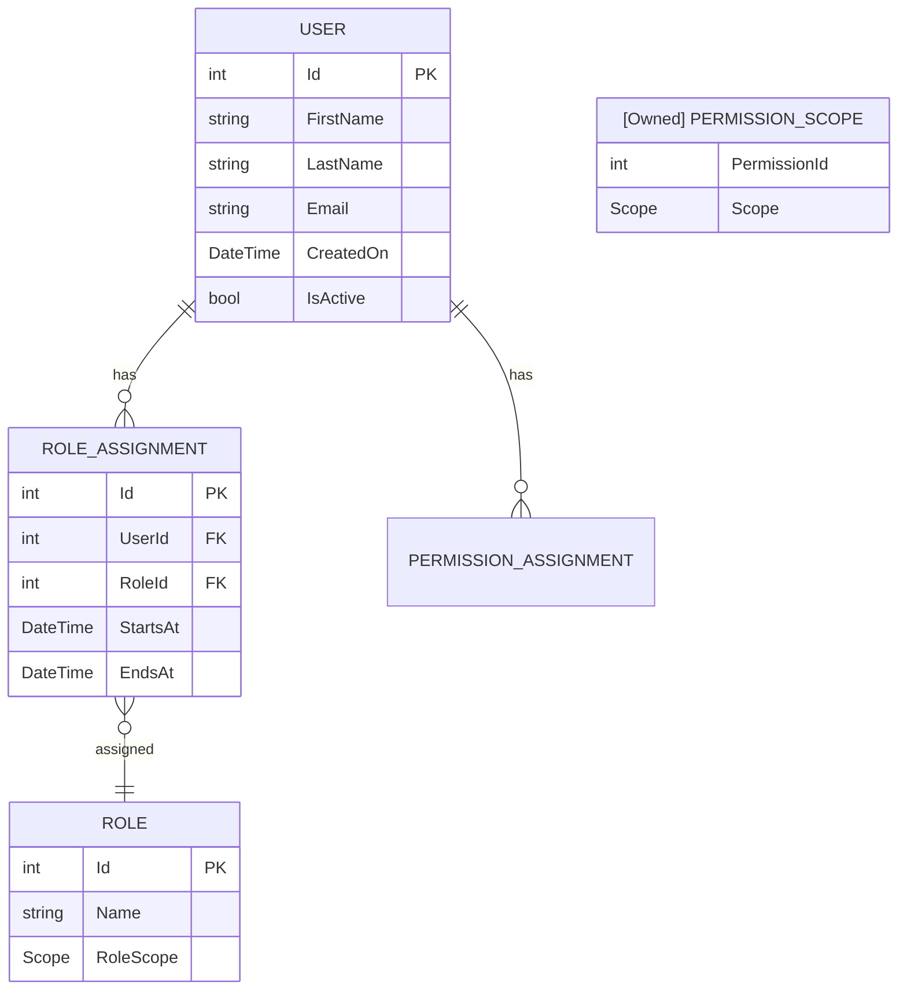

# ER Diagrams

ER diagrams describe the **data model** for a use case. Use one when the UC introduces new entities or non-obvious relationships.

## File and placement

| Rule | Detail |
|------|--------|
| Location | `use-cases/NN_slug/UC0X_<Topic>_ER_Diagram.md` (or inline in the requirements doc under `## Technical Design`) |
| Format | Mermaid `erDiagram` |
| Followed by | A short **SQL Tables** descriptive table |

## Template

````markdown
### ER Diagram



### SQL Tables

| Table | Description |
|-------|-------------|
| User | The user table of the system |
| Role | A "package" of permissions that can be granted as a unit |
| RoleAssignment | Assigns a role to a user within a specific time period |
| PermissionScope | (Owned) Permission to do some action over a defined scope |
````

## Conventions

| Element | Convention | Example |
|---------|------------|---------|
| Entity names | `UPPER_SNAKE_CASE` in the diagram | `ROLE_ASSIGNMENT` |
| Owned entities | Prefix with `"[Owned] "` (quoted) | `"[Owned] PERMISSION_SCOPE"` |
| Relationship cardinality | Mermaid notation | `||--o{` one-to-many, `}o--||` many-to-one |
| Field types | Lowercase primitives, PascalCase domain types | `int Id PK`, `Scope RoleScope` |
| Keys | Suffix with `PK` / `FK` | `int RoleId FK` |
| Field order | `Id` first, then required, then optional, then audit fields | `CreatedOn`, `UpdatedOn` last |

## Mermaid cardinality cheat-sheet

| Notation | Meaning |
|----------|---------|
| `||--||` | exactly one to exactly one |
| `||--o{` | one to zero-or-many |
| `||--|{` | one to one-or-many |
| `}o--o{` | many to many (optional both sides) |
| `}|--|{` | many to many (required both sides) |

## Rules

| MUST | MUST NOT |
|------|----------|
| Follow the diagram with a **SQL Tables** description table | Leave readers to interpret the ER alone |
| Mark owned entities with `[Owned]` and explain in the table | Hide owned-vs-aggregate-root distinctions |
| Use PK / FK suffixes on every key | Rely on convention readers don't share |
| Keep entities focused on the UC | Dump the whole system's schema into every UC's ER |
| Cross-reference shared entities — don't redefine them | Re-declare `USER` in every UC |

## When to put the ER inline vs in its own file

| Inline (under `## Technical Design`) | Separate `UC0X_<Topic>_ER_Diagram.md` |
|--------------------------------------|----------------------------------------------|
| ≤ 5 entities | More than 5 entities |
| Tightly bound to the UC | Reused across UCs / referenced by multiple docs |
| No alternative variants | Has alternative views (e.g. permission scopes diagram) |

## Related

- [state-machines.md](state-machines.md)
- [sequence-diagrams.md](sequence-diagrams.md)
- [../content/use-case-document.md](../content/use-case-document.md)
