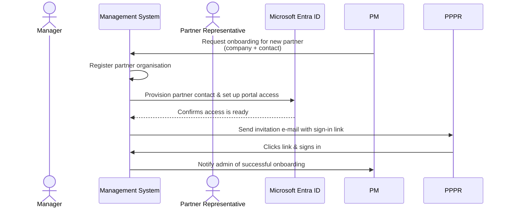
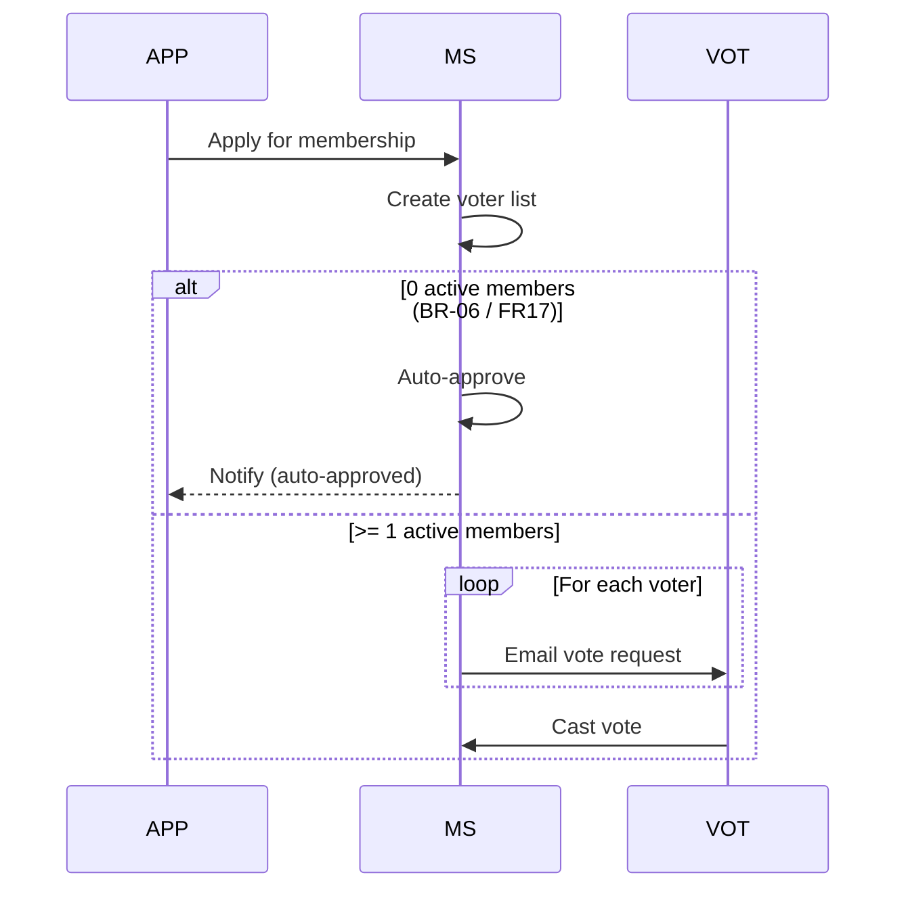

# Sequence Diagrams

Sequence diagrams document **workflows** — the ordered exchange of messages between actors and the system. Use them for every non-trivial use case.

## File and placement

| Rule | Detail |
|------|--------|
| Location | `use-cases/NN_slug/UC0X_<Topic>_SequenceDiagram.md` |
| One workflow per file | Onboarding *application* and onboarding *finalisation* = two files |
| Always mermaid | Mermaid `sequenceDiagram` block inside a fenced code block |
| Companion PNG | Optional pre-rendered export sits alongside |

## Template

````markdown
Use the mermaid code below:


````

## Conventions

| Element             | Convention                  | Example                                            |
| ------------------- | --------------------------- | -------------------------------------------------- |
| Humans              | `actor` keyword             | `actor M as Manager`                               |
| Systems / services  | `participant` keyword       | `participant System as Management System`          |
| Aliases             | Short uppercase             | `PM`, `PMS`, `VOT`, `VS`, `VC`                     |
| Synchronous call    | `->>`                       | `PM ->> System: Request onboarding`                |
| Response            | `-->>` (dashed)             | `EntraID -->> System: Confirms access`             |
| Self-call           | participant to itself       | `System ->> System: Register partner organisation` |
| Line break in label | `<br/>`                     | `Send vote request<br/>(unique VoteCode link)`     |
| Conditional flow    | `alt … else … end`          | see below                                          |
| Optional step       | `opt <condition> … end`     | only-on-error branches                             |
| Iteration           | `loop For each voter … end` | bulk sends                                         |
| Annotation          | `Note over A,B: <text>`     | rule reminders / BR refs                           |
| Section comment     | `%% — Step 1: …`            | breaks long diagrams into stages                   |

## Alt / loop example



## Rules

| MUST | MUST NOT |
|------|----------|
| Use `actor` for humans and `participant` for systems | Mark every party as `participant` |
| Annotate steps with BR / FR references in `<br/>` notes when useful | Make readers cross-reference silently |
| Stage long diagrams with `%% — Section name —` comments | Ship a 60-step wall of arrows |
| Distinguish requests (`->>`) from responses (`-->>`) | Use only solid arrows |
| Match actor aliases to persona names in `personas.md` | Invent new role names in the diagram |

## When to split into multiple diagrams

Split when:

- The workflow has clearly separable phases (e.g. application → signing → finalisation).
- More than one starting actor begins their own flow.
- The diagram exceeds ~ 40 messages.

The use-case folder can hold any number of sequence-diagram `.md` files — name each by phase: `UC03_OnboardingApplication_SequenceDiagram.md`, `UC03_Onboarding_SequenceDiagram.md`.

## Related

- [state-machines.md](state-machines.md)
- [er-diagrams.md](er-diagrams.md)
- [../content/personas.md](../content/personas.md)
