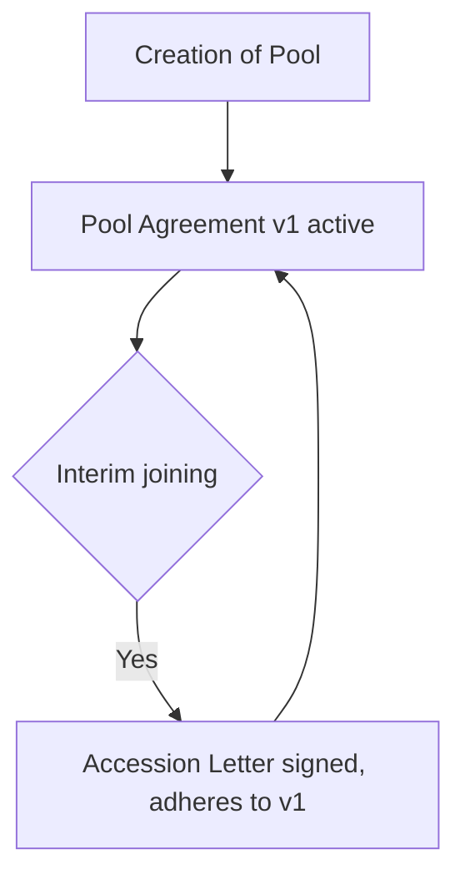

# State Machines

State machines describe the lifecycle of a domain entity (e.g. an application, a workflow). Use them when an entity has ≥ 3 distinct states or any non-trivial branching.

## Two-part structure

A state machine section is **always two parts**:

1. The diagram (ASCII or mermaid `stateDiagram` / `flowchart`)
2. A **State Descriptions** table

### Part 1 — diagram (ASCII)

ASCII diagrams are preferred inside `UC0X_requirements.md` because they render anywhere and read cleanly in source.

```text
Requested → VoteListPrepared → VoteRequested → VotePending → VoteCounting → VoteCompleted → Approved
     │                                              ↑              ↓                           ↓
     │                                              └──────────────┘                       Rejected
     │                                         (back if threshold not met)
     │
     └──→ Approved   (auto-approved: 0 active members in pool, see BR-06)
```

Use arrows `→`, `↓`, `↑`, `↘` and inline parenthetical conditions. Comments belong in parentheses on the line they describe.

### Part 2 — state descriptions table

```markdown
| State | Description | Triggered By |
|-------|-------------|--------------|
| Requested | Application submitted | Pool Partner applies / Vessel onboarding triggers (FR1, FR9) |
| VoteListPrepared | Voter list created from current pool members | System (FR2) |
| VoteCompleted | Vote concluded by Vote Concluder | Vote Concluder action (FR11) |
| Approved | Application approved, PoolMembership created (IsActive=false) | FR7 |
```

| Column | Required | Notes |
|--------|----------|-------|
| State | Yes | PascalCase, matches code if implemented |
| Description | Yes | One line |
| Triggered By | Yes | Actor or FR reference that causes entry to this state |

Add a `FR Reference` column when triggers don't already cite FRs in the Description column.

## Mermaid alternative (separate file)

For complex state machines, ship a separate `UC0X_<Topic>_StateDiagram.md` with mermaid:

````markdown

````

Even with a separate file, the **State Descriptions table stays inside the requirements doc**.

## Rules

| MUST | MUST NOT |
|------|----------|
| Use one consistent state-name spelling (PascalCase) across diagram, table, FRs, BRs, code | "VoteCounting" in the diagram, "Vote Counting" in the table |
| Reference FRs in the Triggered By column | Leave triggers implicit |
| Make terminal states visually obvious (no outgoing arrows) | Hide them mid-flow |
| Include error / cancelled / expired branches when they exist | Document only the happy path |
| Place complex mermaid diagrams in their own `.md` file | Inline an unscannable wall of mermaid in the requirements doc |

## Multiple state machines per UC

When a UC has more than one stateful entity (e.g. an Application *and* a Workflow), use multiple subsections:

```markdown
## State Machines

### OnboardingApplication State Machine
…

### OnboardingWorkflow State Machine
…
```

Each gets its own diagram + state descriptions table.

## Related

- [sequence-diagrams.md](sequence-diagrams.md)
- [er-diagrams.md](er-diagrams.md)
- [../content/business-rules.md](../content/business-rules.md)
