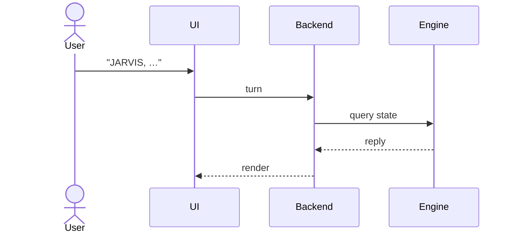

# Diagrams

A diagram is mandatory once a doc passes the length floor (> 80 lines). Pick the **right kind for the
content** — the wrong tool is as bad as none. Mermaid is the default because it diffs in git and renders
in the browser; ASCII and images are for the cases Mermaid serves poorly.

## Which diagram

| Content | Tool | Why |
|---------|------|-----|
| Flow, sequence, state, decision | **Mermaid** | Diffable, renders inline, no binary |
| Layer stack / cleanly nested boxes | **ASCII** in ` ```text ` | Box-drawing reads clearer for boxes that nest one-per-group |
| Topology where a node spans groups | **Mermaid** `flowchart` + `subgraph` | Subgraphs show membership; edges show one node on several networks — ASCII boxes can't |
| Branded / business / domain diagram | **Image** + editable source | Needs polish Mermaid can't give |
| A quick "A → B → C" | Inline ` ```text ` | A full diagram is overkill |

## Mermaid — the default

Use for request flow (`flowchart`), interactions over time (`sequenceDiagram`), and lifecycles (`stateDiagram-v2`).

````markdown

````

| Rule | Detail |
|------|--------|
| Humans are `actor`, systems are `participant` | Consistent across every sequence diagram |
| One spelling per node, matching the prose | `Backend` in the diagram = `Backend` in the text |
| `alt` / `loop` for branches and retries | Don't fake them with prose under the diagram |

## ASCII — for cleanly nested layers

````markdown
```text
┌─────────────────────────────┐
│   API Layer (endpoints)     │
└──────────────┬──────────────┘
               ▼
┌─────────────────────────────┐
│   Domain Layer (services)   │
└──────────────┬──────────────┘
               ▼
┌─────────────────────────────┐
│   Data Layer (DbContext)    │
└─────────────────────────────┘
```
````

Always inside a ` ```text ` fence so box-drawing characters render verbatim.

> ⚠️ **One node, several groups?** When a box belongs to multiple groups at once (a service on several networks), nested ASCII boxes break down and hand-alignment gets fragile. Switch to a Mermaid `flowchart` with one `subgraph` per group.

## Images — for branded diagrams only

| Rule | Detail |
|------|--------|
| Ship the editable source | `domain-model.png` lives beside `domain-model.drawio` (or `.excalidraw`) |
| Reference relatively | `` |
| Never for flow/sequence/state | Those are Mermaid — a PNG of a flowchart can't be diffed or edited |

## Rules

| MUST | MUST NOT |
|------|----------|
| Give every doc > 80 lines ≥ 1 diagram or major table | Wall of prose with no visual relief |
| Match node names to the surrounding text | Introduce a synonym only in the diagram |
| Code-fence every diagram with a language tag | Render a "diagram" as a prose bullet list |

## Related

- [README.md](README.md)
- [house-style.md](house-style.md)
- [iconography.md](iconography.md)
