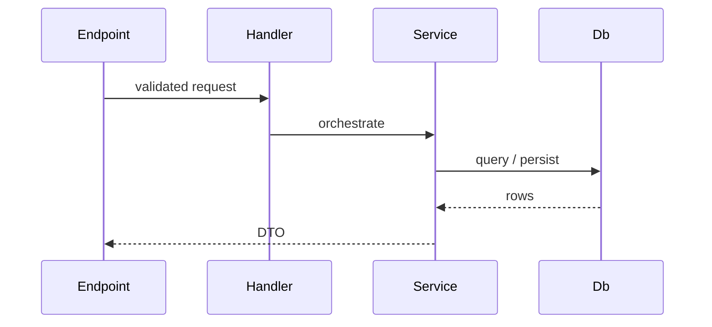

# Backend / Architecture Doc Template

Documents how the backend is built: the shape (monolith vs microservices), the layers or modules, how a
request flows, and where the boundaries are. A reader should know where new code goes after reading it.

## Section order

| # | Section | Required | Notes |
|---|---------|----------|-------|
| 1 | `# Backend` (or subsystem name) | Yes | One H1 |
| 2 | `## Shape` | Yes | Monolith / modular monolith / microservices + why |
| 3 | `## Layers` (or `## Modules`) | Yes | ASCII layer stack or module table |
| 4 | `## Request flow` | Yes | One Mermaid sequence for a representative request |
| 5 | `## Boundaries` | Recommended | What each layer/module may and may not do |
| 6 | `## Cross-cutting` | Optional | Auth, logging, errors — link out, don't inline |

## Skeleton

````markdown
# Backend

A modular monolith: one deployable, hard module boundaries inside.

## Shape

| Decision | Choice | Why |
|----------|--------|-----|
| 📦 Topology | Modular monolith | One deploy; module seams allow later extraction |
| Persistence | Postgres + EF Core | Relational core; DbContext used directly |
| API style | REST over HTTP | Simple, cacheable, well-understood |

**See:** [ADR-0001](./adr/0001-modular-monolith.md) for the full rationale.

## Layers

```text
┌─────────────────────────────┐
│  API (endpoints, handlers)  │
└──────────────┬──────────────┘
               ▼
┌─────────────────────────────┐
│  Domain (services, rules)   │
└──────────────┬──────────────┘
               ▼
┌─────────────────────────────┐
│  Data (DbContext, entities) │
└─────────────────────────────┘
```

## Request flow



## Boundaries

| Layer | May | May not |
|-------|-----|---------|
| API | validate, map DTOs, call one handler | hold business rules |
| Domain | orchestrate, enforce rules | know about HTTP |
| Data | query, persist | call services |

## Cross-cutting

| Concern | Doc |
|---------|-----|
| 🔒 Auth | **See:** [Auth](./auth.md) |
| Errors | **See:** [Error handling](./errors.md) |
````

## Rules

| MUST | MUST NOT |
|------|----------|
| State the topology **and the reason**; link the ADR | Assert "microservices" with no rationale |
| ASCII for the layer stack, Mermaid for the flow | A PNG of a flowchart |
| Put boundaries in a may / may-not table | Bury layer rules in prose |
| Link cross-cutting concerns out | Inline auth/logging detail here |

> Delete this guidance block and the example content when you copy the skeleton.

## Related

- [../house-style.md](../house-style.md)
- [../diagrams.md](../diagrams.md)
- [adr.md](adr.md)
