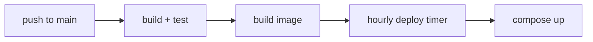

# Deployment / Infra Doc Template

Documents how the system ships and runs: what builds it, what hosts it, which environments exist, how the
network is shaped, where secrets come from, and the runbook for common ops. A reader should be able to
deploy and diagnose after reading it.

## Section order

| # | Section | Required | Notes |
|---|---------|----------|-------|
| 1 | `# Deployment` | Yes | One H1 |
| 2 | `## Topology` | Yes | What runs where — diagram or table |
| 3 | `## Environments` | Yes | dev / staging / prod table |
| 4 | `## Pipeline` | Yes | Build → deploy steps |
| 5 | `## Networking` | If applicable | Networks, ports, trust boundaries |
| 6 | `## Secrets & config` | Recommended | Where values come from (not the values) |
| 7 | `## Runbook` | Recommended | Common ops as command tables |

## Skeleton

````markdown
# Deployment

Prod runs as a Docker Compose stack behind a Caddy TLS proxy on one host.

## Topology

```text
Internet ──► Caddy (TLS) ──► api ──► Postgres
                              └────► Redis
```

## Environments

| Env | Host | URL | Brought up by |
|-----|------|-----|---------------|
| dev | local | localhost:8202 | `npm run dev` |
| prod | kb-personal | jarvis.example.dk | `npm run prod:start` |

## Pipeline



## Networking

| Network | Members | 🔒 Isolates |
|---------|---------|-------------|
| data | api, postgres, redis | DB off the public edge |
| edge | caddy, api | TLS termination |
| engine_egress | engine | untrusted engine off the host |

## Secrets & config

| Value | Source | Notes |
|-------|--------|-------|
| DB password | `.env` (git-ignored) | generated by `npm run setup` |
| TLS cert | Caddy auto (ACME) | renewed automatically |

## Runbook

| Task | Command |
|------|---------|
| 🚀 Deploy | `npm run prod:start` |
| Status | `npm run prod:status` |
| Logs | `docker compose -p jarvis logs -f api` |
````

## Rules

| MUST | MUST NOT |
|------|----------|
| Show topology as a diagram or table | Describe the network in a paragraph |
| Put environments in one table | Scatter env detail across the doc |
| Name the **source** of each secret | Paste an actual secret value |
| Give the runbook as command tables | Prose-narrate "first run X, then Y" |

> Delete this guidance block and the example content when you copy the skeleton.

## Related

- [../house-style.md](../house-style.md)
- [../diagrams.md](../diagrams.md)
- [../iconography.md](../iconography.md)
