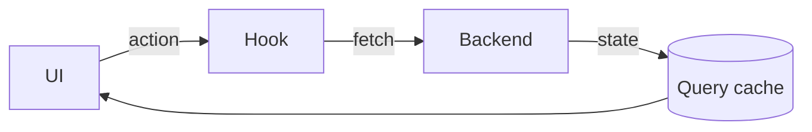
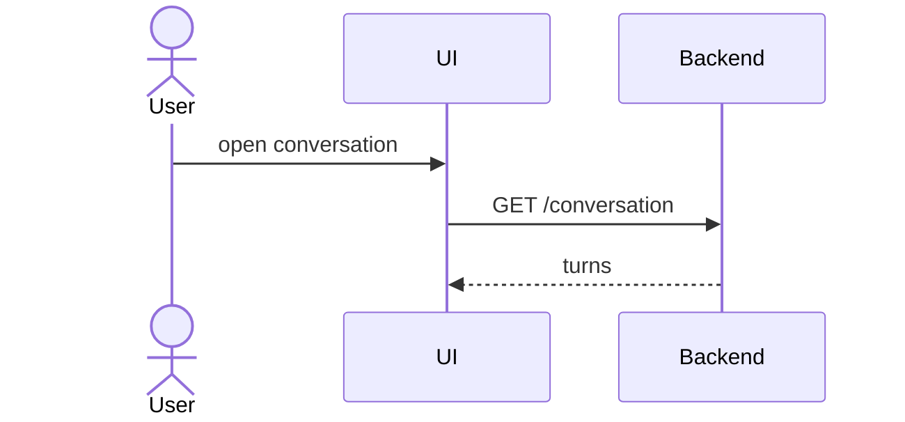

# Frontend Doc Template

Documents the app/UI: what framework, how state flows, how it's styled, what the components are, and
how a key user journey moves through them. A new developer should know where to add a screen after reading it.

## Section order

| # | Section | Required | Notes |
|---|---------|----------|-------|
| 1 | `# Frontend` | Yes | One H1 |
| 2 | `## Stack` | Yes | Table: choice / version / why |
| 3 | `## State management` | Yes | Where state lives; server vs client; the flow |
| 4 | `## Styling` | Yes | CSS approach, tokens, theming |
| 5 | `## Structure` | Yes | Component/route map table |
| 6 | `## Key flows` | Recommended | 1–2 Mermaid sequences for core journeys |
| 7 | `## Build & run` | Recommended | Dev server, build, where it deploys (link) |

## Skeleton

````markdown
# Frontend

The desktop shell and web app — one React codebase, two build targets.

## Stack

| Choice | Version | Why |
|--------|---------|-----|
| 🎯 Framework | React 19 + Vite | Fast HMR; same code ships Electron + web |
| Language | TypeScript (strict) | Types across the BFF boundary |
| State | TanStack Query + Zustand | Server cache vs local UI state, kept separate |
| Styling | StyleX (design tokens) | Tokens as the only source of design values |

## State management

| State kind | Lives in | Example |
|------------|----------|---------|
| Server data | TanStack Query cache | conversation, user profile |
| Local UI | Zustand store | mic open, active panel |
| URL | router params | selected resource id |



## Styling

- **Tokens**: colors, spacing, type, radii come from semantic tokens — no hardcoded values.
- **Theming**: token override per theme; components never branch on theme.
- **Primitives**: tables, cards, badges, page headers are shared primitives — never handwritten chrome.

## Structure

| Layer | Folder | Holds |
|-------|--------|-------|
| Pages | `src/app/pages` | Thin route shells — imports + return |
| Features | `src/app/features` | Feature components + hooks |
| Primitives | `src/app/shared/ui` | Design-system building blocks |
| Services | `src/app/shared/services` | Backend clients, telemetry |

## Key flows



## Build & run

| Task | Command |
|------|---------|
| Dev server | `npm run dev:web` |
| Build | `npm run build` |
| Deploy | **See:** [Deployment](../deployment/index.md) |
````

## Rules

| MUST | MUST NOT |
|------|----------|
| State the framework **and the reason** in the Stack table | List the framework with no rationale |
| Separate server state from client state explicitly | Lump all state into "we use a store" |
| Map components/routes in a table | Describe the folder tree in prose |
| Use Mermaid for the key flow | Narrate the flow as a numbered paragraph |

> Delete this guidance block and the example content when you copy the skeleton.

## Related

- [../house-style.md](../house-style.md)
- [../diagrams.md](../diagrams.md)
- [backend-architecture.md](backend-architecture.md)
