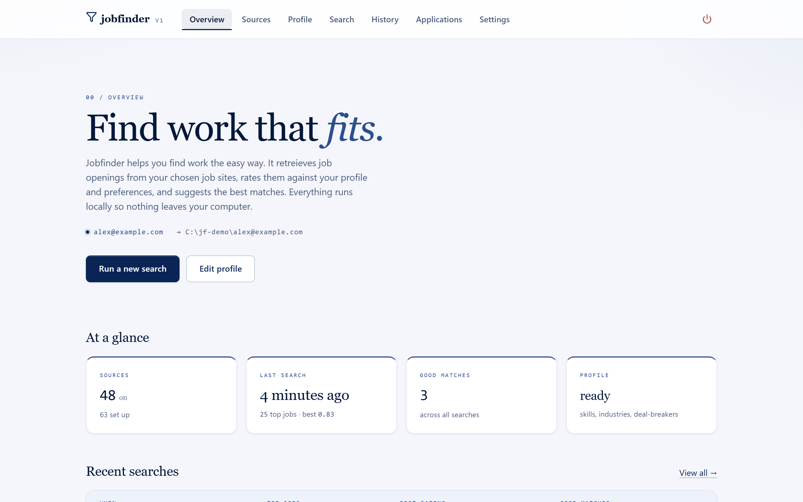
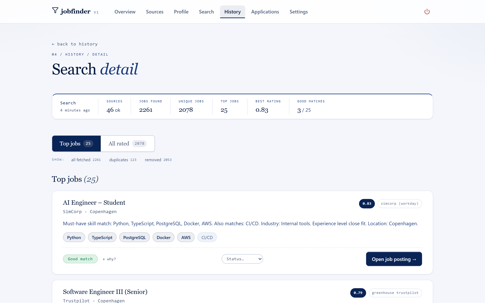
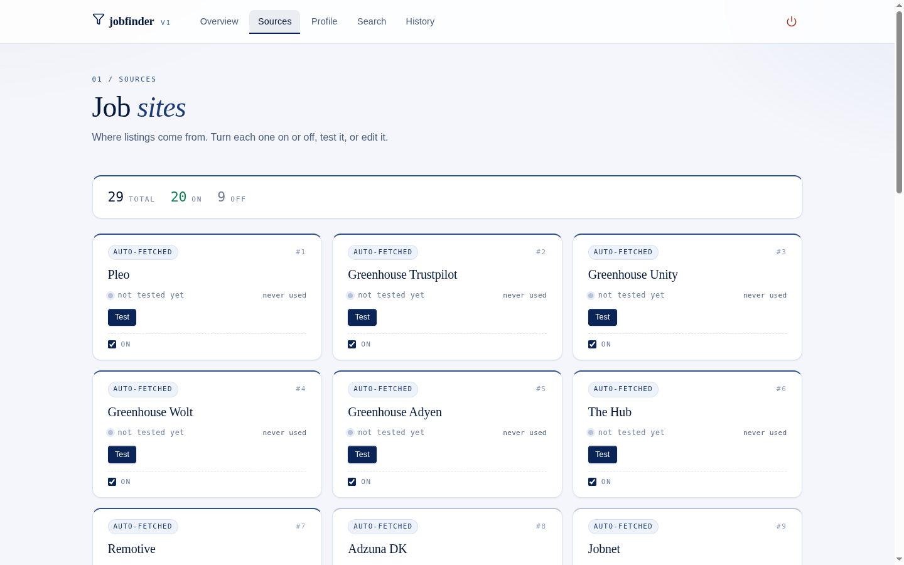
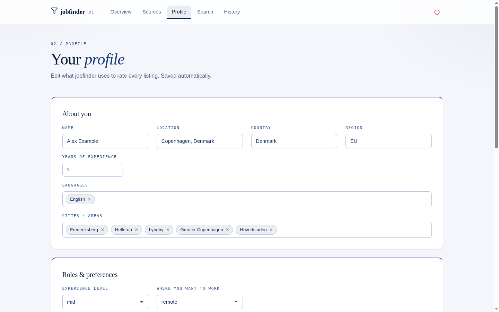
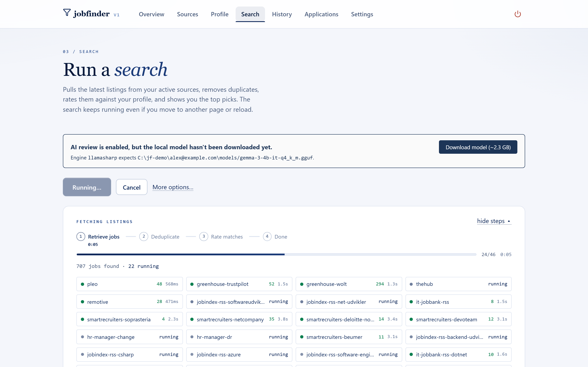

<div align="center">


<h3>jobfinder</h3>
<p>A local-first job-search assistant that runs on your laptop.</p>
<p>
    
    
    
    
    
</p>
<p>
    
    
    
</p>

</div>

<p align="center">

</p>

---

## Why

Job boards are noisy. The same handful of roles that actually fit you are buried under hundreds that don't, spread across a dozen different sites, each with its own layout and its own idea of "relevant."

**jobfinder** turns that into a single button. You describe yourself once — your stack, your seniority, where you'll work, your deal-breakers. You pick the sites worth checking. Then, on demand, it pulls every opening, throws out the duplicates, scores what's left against *your* profile, and hands you a short, ranked shortlist with an honest reason for each pick.

And it stays yours. No sign-up, no cloud account, no telemetry. Your skillset, your provider list, your search history, and your "good match" marks all live in a folder on your own disk.

---

## See it in action

<p align="center">

</p>
<p align="center"><i>One run: 801 openings pulled from 17 sources, deduped to 784, ranked to the top 25 — each with a score and a plain-English reason.</i></p>

<details>
<summary><b>Gallery</b> — the app, screen by screen</summary>
<br>
<p align="center">


</p>
<p align="center">
<i>Providers — toggle each job site on or off, test it, edit it.</i>
&nbsp;&nbsp;·&nbsp;&nbsp;
<i>Profile — the skillset every listing is scored against.</i>
</p>
<p align="center">


</p>
<p align="center">
<i>Search — every provider fetched live, with counts and failures shown.</i>
&nbsp;&nbsp;·&nbsp;&nbsp;
<i>Overview — sources, last run, and good matches at a glance.</i>
</p>
</details>

---

## What you get

- **One skillset, one file.** Your stack, seniority, location, languages, and deal-breakers live in a single Markdown file. Edit it any time — every search uses the latest version.
- **The providers you actually use.** Pick from job sites and boards (Greenhouse, The Hub, Jobindex, Remotive, SmartRecruiters, and more). Toggle each on or off; test one in isolation before you trust it.
- **A ranked shortlist on demand.** One click checks every enabled provider, removes duplicates, scores everything against your skillset, and surfaces the top matches — each with the must-have skills it hit, the nice-to-haves, and why it landed where it did.
- **A memory of every run.** Searches are kept. Look back at last Sunday's run, see which listings came up, and how many you marked as a real fit.
- **A feedback loop that learns.** Mark listings as good matches. Those signals feed back into the ranking so the next run puts more of what you liked up top.
- **An optional on-device AI judge.** Drop in a local LLM (Gemma 3 4B via LlamaSharp) to sharpen the keyword scoring with a second opinion — entirely offline. Without it, jobfinder falls back to transparent keyword ranking.

---

## How it works

```
providers → fetch → dedupe → score (skillset + optional LLM) → rank → your shortlist
                                                  ↑
                                          good-match marks
```

- **Fetch.** Pluggable adapters pull listings from each enabled provider (RSS, HTML, Greenhouse, TeamTailor, SmartRecruiters, HR-Manager, Jobindex …).
- **Dedupe.** The same role posted to three boards collapses to one.
- **Score.** Each listing is rated against your skillset — must-have hits, secondary hits, seniority, location, freshness. An optional local LLM refines the score.
- **Rank & learn.** The top matches float up; your good-match marks tune future runs.

The whole pipeline lives in the `Jobmatch` library; the API server (`Jobmatch.Api`) wraps it, and the React app is the front door.

---

## Get started

<i>Prerequisites: .NET 10 SDK, Node.js 20+</i>

```bash
# clone, then from the repo root:
npm run dev
```

`npm run dev` starts the API and the web client together on free ports and opens the app in your browser. React changes hot-reload instantly; C# changes reload the server.

Prefer it as an installed app? Package and install the self-contained desktop tool:

```bash
npm run package        # builds the SPA + bundles the dotnet tool
npm run install:tool   # installs `jobfinder` as a global .NET tool
jobfinder              # launch it from anywhere
```

**On Windows, just want the installer?** Every push to `main` builds a self-contained
`jobfinder-setup-*.exe` (no .NET or Node needed) and attaches it to the rolling
[**latest** release](../../releases/tag/latest). Download it, run it, and launch jobfinder from the
Start menu. (It's unsigned, so SmartScreen may say "unknown publisher" — choose **More info → Run anyway**.)

Want to build that Windows installer yourself without GitHub?

```bash
npm run package:win    # self-contained backend publish + electron-builder NSIS installer
                       # → src/desktop/release/jobfinder-setup-*.exe
```

Run the resulting `jobfinder-setup-*.exe` to install the desktop app. On first launch jobfinder asks
you to confirm where to store your data (it suggests a folder; you choose) — nothing is written until
you agree.

Other scripts: `npm run build` (release build), `npm test` (backend suite), `npm run test:client` (frontend), `npm run test:e2e` (Playwright).

### Optional: the local AI judge

jobfinder ranks with keywords out of the box. To enable the on-device LLM judge, download the Gemma 3 4B GGUF (~2.3 GB) from the **Search** screen — it runs in-process via LlamaSharp, fully offline. Nothing about your search ever leaves the machine.

---

- [`CHANGELOG.md`](./CHANGELOG.md) — what's shipped.

---

<div align="center">
<sub>Runs on your laptop. Stays on your laptop.</sub>
</div>
